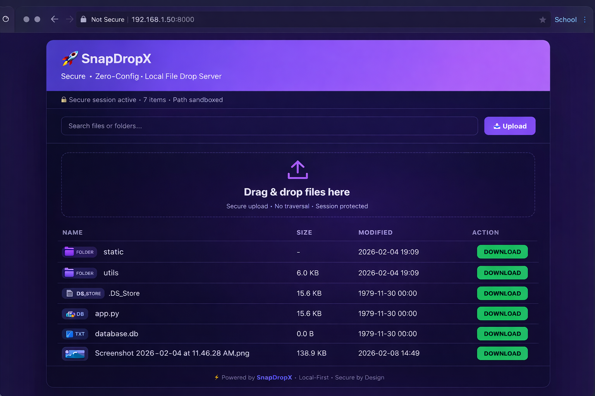

# 🚀 SnapDropX

> Secure · Zero-Config · Local File Drop Server

**SnapDropX** is a modern, secure alternative to `python -m http.server` with a
beautiful web UI, drag-and-drop uploads, authentication, and HTTPS support.
Perfect for quickly sharing files between machines or within a local network.

---

## ✨ Features

- 🔐 **Secure by Default** – Optional HTTP Basic Authentication
- 📤 **Upload Support** – Drag & drop files directly from browser
- ⚡ **Fast & Lightweight** – Start server in under 1 second
- 🎨 **Modern UI** – Clean, responsive interface (desktop + mobile)
- 🔍 **Search & Filter** – Quickly find files in large directories
- 🛡️ **Path Protection** – Prevents directory traversal attacks
- 📱 **Mobile Friendly** – Upload files from your phone
- 🔒 **HTTPS Support** – Self-signed SSL for encrypted transfer

---

## 🖥️ Preview



---

## 🚀 Quick Start

### Installation

Clone from GitHub and install in editable mode:

```bash
git clone https://github.com/vertexcrew/snapdropx.git
cd snapdropx
pip install -e .
snapdropx
http://localhost:8000
snapdropx /path/to/files
snapdropx --port 8080

snapdropx --auth username:password
snapdropx --ssl
snapdropx /data --port 8443 --auth admin:secret --ssl
snapdropx --host 0.0.0.0 --port 8000 --auth user:pass
http://YOUR_LOCAL_IP:8000
| Endpoint           | Method | Description         |
| ------------------ | ------ | ------------------- |
| `/`                | GET    | List root directory |
| `/browse/{path}`   | GET    | Browse subdirectory |
| `/download/{path}` | GET    | Download file       |
| `/upload`          | POST   | Upload files        |
| `/health`          | GET    | Health check        |

# Single file
curl -F "files=@file.txt" http://localhost:8000/upload

# With authentication
curl -u username:password -F "files=@file.txt" http://localhost:8000/upload

# Multiple files
curl -F "files=@a.txt" -F "files=@b.txt" http://localhost:8000/upload

# Upload into subfolder
curl -F "files=@file.txt" -F "path=subdir" http://localhost:8000/upload

pip install -e ".[dev]"
pytest tests/ -v
snapdropx/
├── src/
│   └── snapdropx/
│       ├── __init__.py
│       ├── main.py        # CLI entrypoint
│       ├── server.py      # FastAPI app
│       ├── security.py    # Auth & path safety
│       ├── static/
│       │   └── style.css
│       └── templates/
│           └── index.html
├── tests/
│   └── test_snapdropx.py
├── assets/
│   └── ui.png
├── pyproject.toml
└── README.md

git checkout -b feature/new-feature
git commit -m "Add new feature"
git push origin feature/new-feature

MIT License
